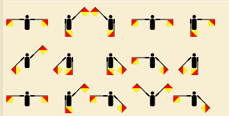

<p align="center">
<!-- 
<a href="https://aseam.acm.org/">
    
  </a>
-->
  <h1 align="center">SIG Cyber</h1>
</p>


# Set-1

<u>Objective</u> : Strengthening Linux Fundamentals

Try the three rooms given below:
- (Part1)[https://tryhackme.com/room/linuxfundamentalspart1]
- (Part2)[https://tryhackme.com/room/linuxfundamentalspart2]
- (Part3)[https://tryhackme.com/room/linuxfundamentalspart3]

**Make a list of the commands learnt**

After Going through room try solving challenges from (Bandit)[https://overthewire.org/wargames/bandit/bandit0.html] upto level 25.


# Set-2

<u>Objective</u> : Testing Basic CTF skills

Here, read about the various domains which are given in ctf's (Reversing, Binary Exploitation, Cryptography,Web exploitation,Forensics).


## Crypto Challenges:

### Basic XOR:

Lets see how well do you know the properties of XOR . Remember the flag format ```recr{``` It might be useull XD.

```ct=1017161a133a4207375c0b1c01371c0d07120015```


### BASED!

Its just a game of bases ;)

```ct= JRTEQN2KIQ2EYTSQK5MHERBRNF3FUYKDJNRVETSBKJZHA6BUKU2TOOLFNJIDCY2FONTEO52QGJZWKWSIHFCDKRBXIZ5DMYKKN5GTK33BPBBW2RRUMNUG6N3ZJBGVQ3KLLJMFATDDGJYEO52FOF4EQNLYGNRGES32MZYU22CWI5FXKVKXMF5FGWCRONQTQWDKKJJHSOLSHBLTQRTLOEZDGVKBGFZUUUDIIZZA==== ```


### Implementations:

Read about Greatest Common Divisor And the Extended GCD. Try implementing it any programming language you are comfortable in.

### Heck_s
Solve the challenges given in set 1 of cryptohack. Document the solutions with the code properly.


## OSHI-(N)-T

### JI X Bean
One of our dear leads loves releasing edits XD you might be lucky if you start searching from there . Btw Rowan's the BEST!!


## Web Exploitation

### Natas
Do the challenges from 1-20 . Make sure to document your progress for each level.

### Tryhackme
Read through and solve the challenges in the room (https://tryhackme.com/room/owasptop102021)


## Reverse Engineering

Get Comfortable with assembly language, try coding a simple hello world program using pure assembly.

you could also use this for reference(https://pwn.college/fundamentals/assembly-crash-course)

Try completing the course along with the challenges.


 

## Juicyy!!!
Download [OWASP-Juice Shop](https://owasp.org/www-project-juice-shop/) and start exploiting the vulnerabilities. Document the vulnerabilities with the screenshots

## Zip-It!

Well our Dear RTX apparently lost the password for the zip file . could you unlock it for him??

refer to the flag.zip file in the directory for the challenge file.


## Size-Matters XD
Let's see if you could solve this variant

```
n=826280450476795403105390383916395625701073920777162153138597185953056944510888027904354828464602421249363674719063026424044747076553321187265165775178889032794638105579799203345357910166892700405175658568627675449699540840288382597105404255643311670752496397923267416409538484199324051251779098290351314013642933189000153869540797043267546151497242578717464980825955180662199508957183411268811625401646070827084944007483568527240194185553478349118552388947992831458170444492412952312967110446929914832061366940165718329077289379496793520793044453012845571593091239615903167358140251268988719634075550032402744471298472559374963794796831888972573597223883502207025864412727194467531305956804869282127211781893423868568924921460804452906287133831167209340798856323714333552031073990953099946860260440120550744737264831895097569281340675979651355169393606387485601024283179141075124116079680183641040638005340147490312370291020282845417263785200481799143148652902589069064306494803532124234850362800892646823909347208346956741220877224626765444423081432186871792825772139369254830825377015531518313838382717867736340509229694011716101360463757629023320658921011843627332643744464724204771008866440681008984222122706436344770910544932757
e=5
ct = 61157966734103371341490589584047901809639618225721810380698297516885678285575048794229133964145600739348505413290761644259197214583972877327534376915178125
```

## Flags_are_sus
Can you figure out this cipher??!!



### Mentors

    1.  Aadithyan Raju                                           2.  Akhil Menon        
        SIG Cyber Lead                                               SIG Cyber Mentor
        Phone No.:- 9562341272                                       Phone No.:- 9400646772

## Submission Deadline for SIG Cyber
**_16/06/2024_**
